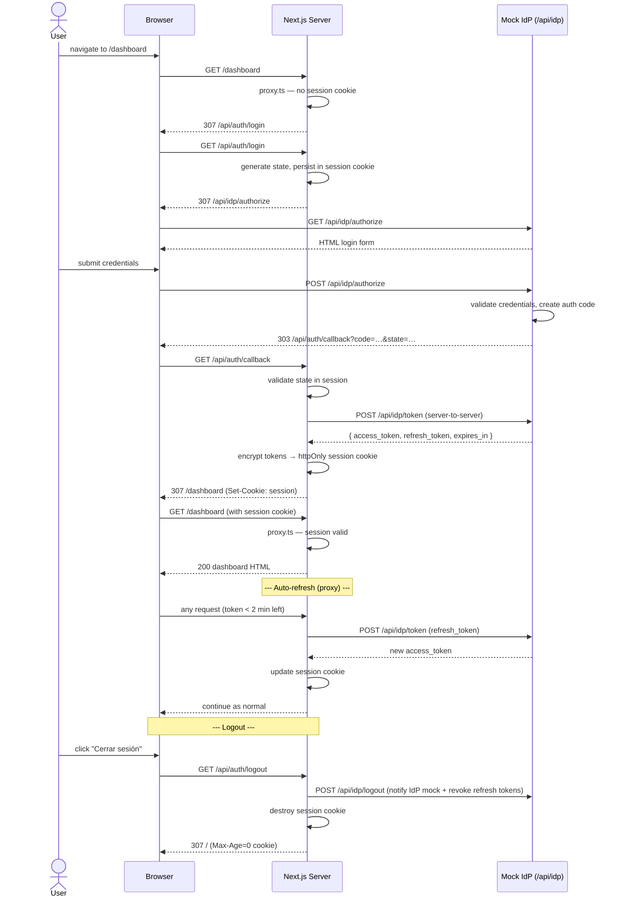

# Auth Demo — Next.js Authorization Code Flow

Server-side OAuth 2.0 Authorization Code Grant with encrypted `httpOnly` session cookies. Access and refresh tokens never leave the server — they are invisible to `document.cookie`, `localStorage`, and the browser console.

---

## Architecture

High-level flow:

1. `src/proxy.ts` protects private routes and redirects unauthenticated requests to `/api/auth/login`.
2. `/api/auth/login` creates OAuth `state` in the encrypted session and redirects to `/api/idp/authorize`.
3. `/api/auth/callback` validates `state`, exchanges `code` on `/api/idp/token`, and stores tokens in the `httpOnly` cookie.
4. `src/proxy.ts` keeps sessions fresh with proactive token refresh before access token expiry.

The sequence diagram below is the source of truth for request/response statuses and redirects.

---

## Sequence diagram (Mermaid)



---

## Setup

### 1. Install dependencies

```bash
npm install
```

### 2. Create `.env.local`

```env
# Secret used by the mock IdP to sign JWTs (HS256)
IDP_JWT_SECRET=replace-with-a-long-random-string

# Password used by iron-session to encrypt the session cookie (min 32 chars)
SESSION_PASSWORD=replace-with-32-plus-character-password-here
```

You can generate suitable values with:

```bash
node -e "console.log(require('crypto').randomBytes(32).toString('hex'))"
```

### 3. Run

```bash
npm run dev      # development
npm run build    # production build
npm start        # production server
npm test         # run test suite
```

Open [http://localhost:3000](http://localhost:3000) and log in with:

| Field    | Value          |
|----------|----------------|
| Email    | demo@test.com  |
| Password | password123    |

---

## Technical decisions

### Why iron-session instead of next-auth?

next-auth (Auth.js) is a complete authentication framework. For this exercise the goal is to understand the OAuth 2.0 Authorization Code flow from scratch — implementing it manually makes every step explicit: state generation, code exchange, token storage, refresh strategy. iron-session provides only the encrypted-cookie primitive; everything else is hand-written.

### Why httpOnly cookies?

Access and refresh tokens stored in `localStorage` or returned as JSON are reachable by any JavaScript on the page, making them a target for XSS. An `httpOnly` cookie is never exposed to `document.cookie` or the browser console — it travels in HTTP headers only and can only be read by the server.

### Why server-side only?

Doing the token exchange on the server means the browser never sees the raw tokens. The server-to-server call to `/api/idp/token` stays within the Node.js process; only an opaque encrypted blob reaches the client.

### Token refresh strategy

Two layers of defence:

1. **Proactive (proxy.ts):** If the access token expires in less than 2 minutes, the proxy refreshes it before the page renders. The user is never interrupted.
2. **Reactive (authFetch.ts):** If a future server-side `fetch` to a protected resource returns `401` (e.g. clock skew), the helper refreshes the token and retries once before throwing `AuthError`.

Refresh requests are bound to the OAuth client identifier stored by the mock IdP, so a refresh token cannot be replayed under a different client.

---

## Project structure

```
src/
├── app/
│   ├── api/
│   │   ├── auth/
│   │   │   ├── callback/route.ts   — exchanges auth code for tokens
│   │   │   ├── login/route.ts      — initiates the OAuth flow
│   │   │   └── logout/route.ts     — destroys session, notifies the IdP mock
│   │   └── idp/
│   │       ├── authorize/route.ts  — mock IdP login page + code issuance
│   │       ├── logout/route.ts     — revokes refresh tokens
│   │       ├── token/route.ts      — code exchange + refresh grant
│   │       └── userinfo/route.ts   — returns user profile for valid token
│   ├── dashboard/page.tsx          — protected server component
│   └── page.tsx                    — public landing page
├── lib/
│   ├── authFetch.ts                — authenticated fetch helper with transparent retry
│   ├── auth-client.ts              — shared OAuth client identifier
│   ├── mock-idp.ts                 — in-memory IdP store + JWT helpers
│   └── session.ts                  — iron-session read/write helpers
└── proxy.ts                        — route protection + proactive token refresh
```
