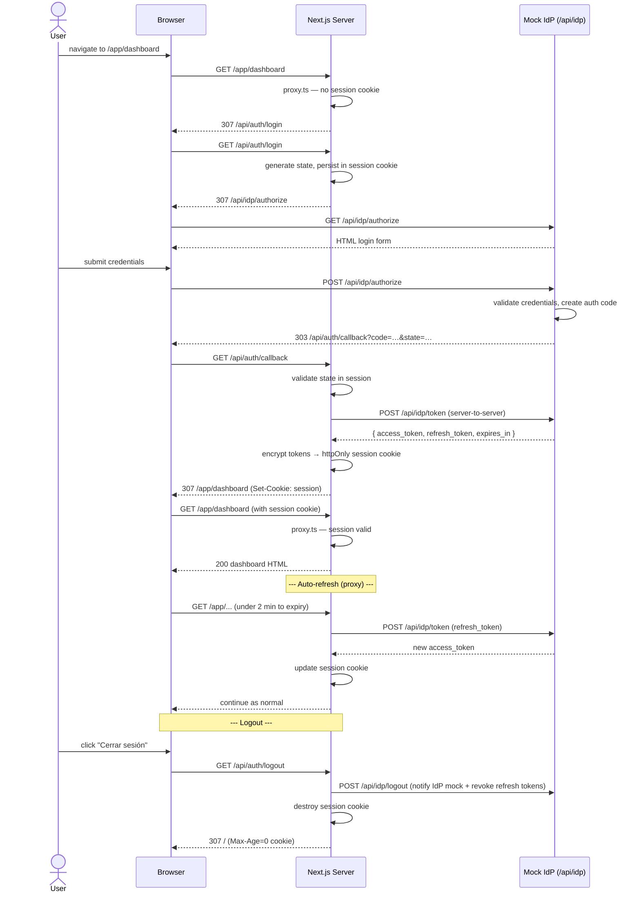

# Auth Demo — Next.js Authorization Code Flow

Server-side OAuth 2.0 Authorization Code Grant with encrypted `httpOnly` session cookies. Access and refresh tokens never leave the server — they are invisible to `document.cookie`, `localStorage`, and the browser console.

---

## Architecture

The app is a Next.js App Router project with **route groups** (folders in parentheses do not appear in the URL):

- **Public UI:** `/` — landing and entry to sign-in; `/auth/error` — readable OAuth failure messages without going through the proxy.
- **Protected UI:** `/app/**` — only these paths are intercepted by `src/proxy.ts` (see `config.matcher`). Everything else under `/app` inherits the same rules.
- **Auth API:** `/api/auth/*` — login redirect, OAuth callback, logout (always reachable; not behind the proxy).
- **Mock IdP:** `/api/idp/*` — authorize UI, token endpoint, userinfo, logout (same host as the app for the exercise).

**High-level flow**

1. A request to a protected page (e.g. `GET /app/dashboard`) hits `src/proxy.ts`. If the encrypted session cookie does not contain valid tokens, the proxy responds with **307** to `/api/auth/login`.
2. `/api/auth/login` stores OAuth `state` in the same iron-session cookie and redirects to **`GET /api/idp/authorize`** with `response_type=code`.
3. After the user signs in at the mock IdP, the browser lands on **`GET /api/auth/callback`**. The handler checks `state`, exchanges `code` for tokens with **`POST /api/idp/token`** (server-to-server), then persists `access_token`, `refresh_token`, and `expires_at` in the cookie and redirects to **`/app/dashboard`**.
4. On later **`GET /app/...`** requests, if the access token expires in less than **2 minutes**, the proxy calls **`POST /api/idp/token`** with `grant_type=refresh_token`, updates the cookie, and continues — no extra navigation for the user.
5. Server components or route handlers that call a protected backend can use **`src/lib/authFetch.ts`**: on **401** it refreshes once, saves the session (where the runtime allows), and retries the same request.

The sequence diagram below is the source of truth for request/response statuses and redirects.

---

## Sequence diagram (Mermaid)



---

## Setup

### 1. Install dependencies

```bash
npm install
```

### 2. Create `.env.local`

```env
# Secret used by the mock IdP to sign JWTs (HS256)
IDP_JWT_SECRET=replace-with-a-long-random-string

# Password used by iron-session to encrypt the session cookie (min 32 chars)
SESSION_PASSWORD=replace-with-32-plus-character-password-here
```

You can generate suitable values with:

```bash
node -e "console.log(require('crypto').randomBytes(32).toString('hex'))"
```

### 3. Run

```bash
npm run dev      # development
npm run build    # production build
npm start        # production server
npm test         # run test suite
```

Open [http://localhost:3000](http://localhost:3000) and log in with:

| Field    | Value          |
|----------|----------------|
| Email    | demo@test.com  |
| Password | password123    |

---

## Technical decisions

### Why iron-session instead of next-auth?

next-auth (Auth.js) is a complete authentication framework. For this exercise the goal is to understand the OAuth 2.0 Authorization Code flow from scratch — implementing it manually makes every step explicit: state generation, code exchange, token storage, refresh strategy. iron-session provides only the encrypted-cookie primitive; everything else is hand-written.

### Why httpOnly cookies?

Access and refresh tokens stored in `localStorage` or returned as JSON are reachable by any JavaScript on the page, making them a target for XSS. An `httpOnly` cookie is never exposed to `document.cookie` or the browser console — it travels in HTTP headers only and can only be read by the server.

### Why server-side only?

Doing the token exchange on the server means the browser never sees the raw tokens. The server-to-server call to `/api/idp/token` stays within the Node.js process; only an opaque encrypted blob reaches the client.

### Why `proxy.ts` and not `middleware.ts`?

Next.js 16 deprecated `middleware.ts` and renamed the file convention to `proxy.ts` (export renamed from `middleware` to `proxy`). It runs **before routing** for URLs matched by `config.matcher` (here, `/app/:path*`), not for the whole site. See the [migration guide](https://nextjs.org/docs/app/api-reference/file-conventions/proxy#migration-to-proxy).

### Token refresh strategy

Two layers of defence:

1. **Proactive (proxy.ts):** If the access token expires in less than 2 minutes, the proxy refreshes it before the page renders. The user is never interrupted.
2. **Reactive (authFetch.ts):** If a future server-side `fetch` to a protected resource returns `401` (e.g. clock skew), the helper refreshes the token and retries once before throwing `AuthError`.

Refresh requests are bound to the OAuth client identifier stored by the mock IdP, so a refresh token cannot be replayed under a different client.

---

## Project structure

```
src/
├── app/
│   ├── (auth)/auth/error/page.tsx       — OAuth error copy (invalid state, token exchange, etc.)
│   ├── (protected)/app/dashboard/
│   │   ├── page.tsx                     — protected dashboard (server component)
│   │   ├── error.tsx                    — dashboard error boundary
│   │   └── loading.tsx                  — dashboard loading UI
│   ├── (public)/page.tsx                — public landing / login entry
│   ├── api/
│   │   ├── auth/
│   │   │   ├── callback/route.ts        — exchanges auth code for tokens
│   │   │   ├── login/route.ts           — initiates the OAuth flow
│   │   │   └── logout/route.ts          — destroys session, notifies the IdP mock
│   │   └── idp/
│   │       ├── authorize/route.ts     — mock IdP login page + code issuance
│   │       ├── logout/route.ts          — revokes refresh tokens
│   │       ├── token/route.ts           — code exchange + refresh grant
│   │       └── userinfo/route.ts        — returns user profile for valid token
│   ├── globals.css
│   └── layout.tsx
├── components/
│   ├── layout/page-shell.tsx            — shared page chrome
│   └── ui/page-card.tsx                 — card layout primitive
├── features/
│   ├── auth/components/                 — login and auth error panels
│   └── dashboard/components/            — dashboard session panel
├── lib/
│   ├── authFetch.ts                     — authenticated fetch + 401 retry
│   ├── auth-client.ts                   — shared OAuth client identifier
│   ├── mock-idp.ts                      — in-memory IdP store + JWT helpers
│   ├── request-body.ts                  — form/json body parsing for route handlers
│   ├── session.ts                       — iron-session read/write helpers
│   ├── token-refresh.ts                 — refresh_token grant to the mock IdP
│   └── test/cookie-helpers.ts           — test utilities for Set-Cookie assertions
├── tests/
│   ├── proxy.test.ts                    — proxy redirect, refresh, and failure paths
│   └── api/
│       ├── auth-routes.test.ts          — login, callback, logout integration tests
│       └── idp-routes.test.ts           — mock IdP token and userinfo tests
├── types/auth.ts                        — shared auth-related TypeScript types
└── proxy.ts                             — route protection + proactive token refresh
```

App routes resolve to URLs without the parentheses: `/`, `/auth/error`, `/app/dashboard`. The proxy `matcher` in `proxy.ts` only protects `/app/:path*`.
